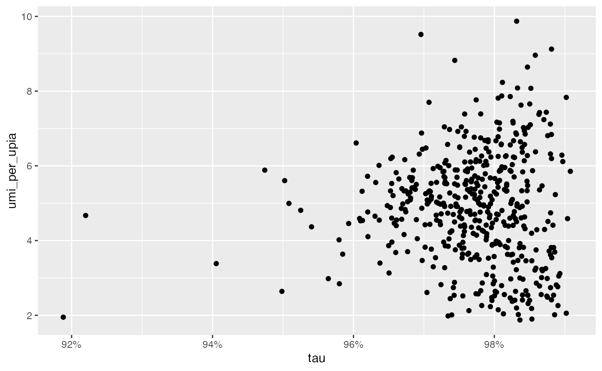

# Load data

``` r
library(pixelatorR)
library(SeuratObject)
library(dplyr)
library(ggplot2)
```

Tip: you can turn off the verbose messages in `pixelatorR` by setting:

``` r
options(pixelatorR.verbose = FALSE)
```

> In this tutorial, we will take a closer look at the functions provided
> in `pixelatorR` to load data. This is mainly intended for advanced
> users. If you want to learn more about how to analyze MPX/PNA data,
> please visit our
> [tutorials](https://software.pixelgen.com/mpx-analysis/introduction).

## Load data

To get started, we need a PXL file which we can download from
<https://software.pixelgen.com/>.

``` r
dir.create("PBMC_data")
download.file(url = "https://pixelgen-technologies-datasets.s3.eu-north-1.amazonaws.com/mpx-datasets/pixelator/0.12.0/1k-human-pbmcs-v1.0-immunology-I/Sample01_human_pbmcs_unstimulated.dataset.pxl?download=1",
              destfile = "PBMC_data/Sample01_human_pbmcs_unstimulated.dataset.pxl")
```

`pixelatorR` provides several functions to load data from a PXL file.

For instance, `ReadMPX_counts` allows us to load only the count matrix
and nothing else:

``` r
pxl_file <- "PBMC_data/Sample01_human_pbmcs_unstimulated.dataset.pxl"
countMatrix <- ReadMPX_counts(pxl_file)
countMatrix[1:5, 1:5]
```

    ##       RCVCMP0000000 RCVCMP0000002 RCVCMP0000003 RCVCMP0000005 RCVCMP0000006
    ## CD274            62            11            25            31            16
    ## CD44            553           180            66           347           213
    ## CD25             12             7             6             8             5
    ## CD279             4             2             0             8             2
    ## CD41              6             1             3             5             6

With `ReadMPX_item`, we can chose a specific item to load from the PXL
file, including: “polarization”, “colocalization”, “edgelist”.

``` r
polarization_scores <- ReadMPX_item(pxl_file, items = "polarization")
```

    ## ! Failed to remove temporary dir C:/Users/max/AppData/Local/Temp/RtmpCW6qSQ/dir5ce46d833fb0

``` r
polarization_scores
```

    ## # A tibble: 33,479 × 6
    ##     morans_i morans_p_value morans_p_adjusted morans_z marker component    
    ##        <dbl>          <dbl>             <dbl>    <dbl> <chr>  <chr>        
    ##  1 -0.00299          0.772              1.000  -0.290  ACTB   RCVCMP0000830
    ##  2 -0.0161           0.177              0.771  -1.35   B2M    RCVCMP0000830
    ##  3  0.0147           0.125              0.633   1.53   CD102  RCVCMP0000830
    ##  4 -0.00678          0.590              1.000  -0.539  CD11a  RCVCMP0000830
    ##  5  0.000836         0.891              1.000   0.137  CD127  RCVCMP0000830
    ##  6 -0.00132          0.145              0.693  -1.46   CD150  RCVCMP0000830
    ##  7 -0.00103          0.395              1.000  -0.851  CD152  RCVCMP0000830
    ##  8 -0.00162          0.0365             0.265  -2.09   CD154  RCVCMP0000830
    ##  9 -0.000919         0.971              1.000  -0.0364 CD162  RCVCMP0000830
    ## 10 -0.000345         0.561              1.000   0.582  CD163  RCVCMP0000830
    ## # ℹ 33,469 more rows

If we provide multiple items, `ReadMPX_item` returns a list instead:

``` r
all_items <- ReadMPX_item(pxl_file, items = c("polarization", "colocalization", "edgelist"))
```

    ## ! Failed to remove temporary dir C:/Users/max/AppData/Local/Temp/RtmpCW6qSQ/dir5ce450a149c3

    ## ! Failed to remove temporary dir C:/Users/max/AppData/Local/Temp/RtmpCW6qSQ/dir5ce4484f1301

``` r
names(all_items)
```

    ## [1] "polarization"   "colocalization" "edgelist"

Alternatively, we can use the wrapper functions `ReadMPX_polarization`,
`ReadMPX_colocaliztion` and `ReadMPX_edgelist` to do the same thing as
`ReadMPX_item`:

``` r
polarization_scores <- ReadMPX_polarization(pxl_file)
```

    ## ! Failed to remove temporary dir C:/Users/max/AppData/Local/Temp/RtmpCW6qSQ/dir5ce41c677f11

is equivalent to

``` r
polarization_scores <- ReadMPX_item(pxl_file, items = "polarization")
```

    ## ! Failed to remove temporary dir C:/Users/max/AppData/Local/Temp/RtmpCW6qSQ/dir5ce44504560

### Seurat

Perhaps the most useful function here is `ReadMPX_Seurat` which allows
us to load MPX data into a `Seurat` object with some additional bells
and whistles provided by `pixelatorR`.

``` r
seur_obj <- ReadMPX_Seurat(pxl_file)
```

    ## ! Failed to remove temporary dir C:/Users/max/AppData/Local/Temp/RtmpCW6qSQ/dir5ce435de523f

    ## ! Failed to remove temporary dir C:/Users/max/AppData/Local/Temp/RtmpCW6qSQ/dir5ce4d1e152c

    ## ! Failed to remove temporary file C:/Users/max/AppData/Local/Temp/RtmpCW6qSQ/file5ce4276f7b80.h5ad

Here, you have a few options to modify how the `Seurat` should be
created. First and foremost, we can set `return_cellgraphassay = FALSE`
to return a `Seurat` object which only includes abundance measurements.

In this simpler data set, only the count matrix is stored as an `Assay`
without any spatial data. This means that almost all information that is
unique to MPX will be ignored so you will not be able to analyze or
visualize graphs and there will be no way to explore the spatial
statistics.

However, this basic data set uses significantly less memory and is
faster to process which can be useful if protein **abundance** is the
only interesting data type for the analysis.

``` r
# Load simpler data set
seur_obj <- ReadMPX_Seurat(pxl_file, return_cellgraphassay = FALSE)
```

    ## Warning: Data is of class matrix. Coercing to dgCMatrix.

    ## ! Failed to remove temporary file C:/Users/max/AppData/Local/Temp/RtmpCW6qSQ/file5ce4406b2854.h5ad

``` r
seur_obj[["mpxCells"]]
```

    ## Assay (v5) data with 80 features for 477 cells
    ## Top 10 variable features:
    ##  CD274, CD44, CD25, CD279, CD41, HLA-ABC, CD54, CD26, CD27, CD38 
    ## Layers:
    ##  counts

By default, `ReadMPX_Seurat` returns the MPX data in an object called
`CellGraphAssay`. This object class extends the `Assay` class from
Seurat and is essentially an `Assay` object with additional data slots.
The `CellGraphAssay` class will be covered in more detail later in this
tutorial.

Most additional parameters in `ReadMPX_Seurat` controls the behavior
when `return_cellgraphassay = TRUE`. By default, the MPX polarization
scores and colocalization scores are loaded and stored in a
`CellGraphAssay` named “mpxCells”.

``` r
seur_obj <- ReadMPX_Seurat(pxl_file)
```

    ## ! Failed to remove temporary dir C:/Users/max/AppData/Local/Temp/RtmpCW6qSQ/dir5ce434fb4916

    ## ! Failed to remove temporary dir C:/Users/max/AppData/Local/Temp/RtmpCW6qSQ/dir5ce44d1664d2

    ## ! Failed to remove temporary file C:/Users/max/AppData/Local/Temp/RtmpCW6qSQ/file5ce42b3d3f72.h5ad

``` r
seur_obj
```

    ## An object of class Seurat 
    ## 80 features across 477 samples within 1 assay 
    ## Active assay: mpxCells (80 features, 80 variable features)
    ##  1 layer present: counts

### Spatial metrics

We can fetch the polarization/colocalization score tables from the
`Seurat` object with the `PolarizationScores` and `ColocalizationScores`
methods:

``` r
# Fetch polarization scores
polarizaton_scores <- PolarizationScores(seur_obj)
polarizaton_scores %>% head()
```

    ## # A tibble: 6 × 6
    ##    morans_i morans_p_value morans_p_adjusted morans_z marker component    
    ##       <dbl>          <dbl>             <dbl>    <dbl> <chr>  <chr>        
    ## 1 -0.00299           0.772             1.000   -0.290 ACTB   RCVCMP0000830
    ## 2 -0.0161            0.177             0.771   -1.35  B2M    RCVCMP0000830
    ## 3  0.0147            0.125             0.633    1.53  CD102  RCVCMP0000830
    ## 4 -0.00678           0.590             1.000   -0.539 CD11a  RCVCMP0000830
    ## 5  0.000836          0.891             1.000    0.137 CD127  RCVCMP0000830
    ## 6 -0.00132           0.145             0.693   -1.46  CD150  RCVCMP0000830

``` r
# Fetch colocalization scores
colocalization_scores <- ColocalizationScores(seur_obj)
colocalization_scores %>% head()
```

    ## # A tibble: 6 × 15
    ##   marker_1 marker_2 pearson pearson_mean pearson_stdev pearson_z pearson_p_value
    ##   <chr>    <chr>      <dbl>        <dbl>         <dbl>     <dbl>           <dbl>
    ## 1 ACTB     ACTB       1            1           0          NA          NA        
    ## 2 ACTB     B2M        0.324        0.317       0.0162      0.429       0.334    
    ## 3 B2M      B2M        1            1           0          NA          NA        
    ## 4 ACTB     CD102      0.304        0.235       0.0167      4.17        0.0000151
    ## 5 B2M      CD102      0.604        0.614       0.00966    -1.06        0.145    
    ## 6 CD102    CD102      1            1           0          NA          NA        
    ## # ℹ 8 more variables: pearson_p_value_adjusted <dbl>, jaccard <dbl>,
    ## #   jaccard_mean <dbl>, jaccard_stdev <dbl>, jaccard_z <dbl>,
    ## #   jaccard_p_value <dbl>, jaccard_p_value_adjusted <dbl>, component <chr>

An equivalent way to extract the polarization scores would be:

``` r
polarizaton_scores <- seur_obj[["mpxCells"]]@polarization
```

But it’s good practice to use
`PolarizationScores`/`ColocalizationScores` which is easier to read. One
just have to make sure that the `DefaultAssay` is set to “mpxCells”.

### QC metrics

Component-specific metrics are stored in the `@meta.data` slot of the
`Seurat` object which can be accessed with double brackets (`[[]]`):

``` r
colnames(seur_obj[[]])
```

    ##  [1] "antibodies"          "edges"               "leiden"             
    ##  [4] "mean_reads"          "mean_umi_per_upia"   "mean_upia_degree"   
    ##  [7] "median_reads"        "median_umi_per_upia" "median_upia_degree" 
    ## [10] "reads"               "tau"                 "tau_type"           
    ## [13] "umi"                 "umi_per_upia"        "upia"               
    ## [16] "upia_per_upib"       "upib"                "vertices"

``` r
seur_obj[[]] %>% head()
```

    ##               antibodies edges leiden mean_reads mean_umi_per_upia
    ## RCVCMP0000000         77 23925      2   6.099645          8.179487
    ## RCVCMP0000002         72  6719      1   5.868135          3.857061
    ## RCVCMP0000003         78  8596      5   5.960330          3.653209
    ## RCVCMP0000005         79 17206      3   5.743520          4.782101
    ## RCVCMP0000006         76 21254      2   5.510445          5.413653
    ## RCVCMP0000007         69  6687      1   5.683565          5.195804
    ##               mean_upia_degree median_reads median_umi_per_upia
    ## RCVCMP0000000         3.134359            5                   5
    ## RCVCMP0000002         2.191160            5                   3
    ## RCVCMP0000003         2.002550            5                   2
    ## RCVCMP0000005         2.540578            5                   3
    ## RCVCMP0000006         2.461793            5                   3
    ## RCVCMP0000007         2.732712            5                   3
    ##               median_upia_degree  reads       tau tau_type   umi umi_per_upia
    ## RCVCMP0000000                  2 145934 0.9832869   normal 23645     8.083761
    ## RCVCMP0000002                  2  39428 0.9734463   normal  6703     3.847876
    ## RCVCMP0000003                  1  51235 0.9825753   normal  8548     3.632809
    ## RCVCMP0000005                  2  98823 0.9733801   normal 17034     4.734297
    ## RCVCMP0000006                  2 117119 0.9864106   normal 21032     5.357106
    ## RCVCMP0000007                  2  38006 0.9710634   normal  6667     5.180264
    ##               upia upia_per_upib upib vertices
    ## RCVCMP0000000 2925      2.881773 1015     3940
    ## RCVCMP0000002 1742      2.927731  595     2337
    ## RCVCMP0000003 2353      3.994907  589     2942
    ## RCVCMP0000005 3598      2.784830 1292     4890
    ## RCVCMP0000006 3926      2.918959 1345     5271
    ## RCVCMP0000007 1287      2.508772  513     1800

We can for instance explore QC metrics visually for component filtering:

``` r
ggplot(seur_obj[[]], aes(tau, umi_per_upia)) +
  geom_point() +
  scale_x_continuous(labels = scales::percent)
```



### Edge lists, graphs and PXL files

The edge list represents the raw MPX data where each row corresponds to
an edge formed between a UPIA and a UPIB pixel. This information is
rarely needed for analysis, but is required if we want to load and
explore component graphs.

`ReadMPX_Seurat` doesn’t load the edge list in memory, instead it keeps
track of the paths of the PXL file(s) associated with the data. We can
get the path to the PXL file with the `FSMap` function:

``` r
FSMap(seur_obj[["mpxCells"]])
```

`FSMap` returns a tibble with the paths to the PXL files associated with
the `Seurat` object. In this case, there is only one PXL file. The
“id_map” column is a list, where each element consists of a tibble with
component IDs that can be used as a look up table to map the “current”
component IDs with the “original” component IDs. If we unnest the
“id_map” column, we can see the current and original component IDs:

``` r
FSMap(seur_obj[["mpxCells"]]) %>% 
  tidyr::unnest(id_map)
```

    ## # A tibble: 477 × 4
    ##    current_id    original_id   sample pxl_file                                  
    ##    <chr>         <chr>          <int> <chr>                                     
    ##  1 RCVCMP0000000 RCVCMP0000000      1 PBMC_data/Sample01_human_pbmcs_unstimulat…
    ##  2 RCVCMP0000002 RCVCMP0000002      1 PBMC_data/Sample01_human_pbmcs_unstimulat…
    ##  3 RCVCMP0000003 RCVCMP0000003      1 PBMC_data/Sample01_human_pbmcs_unstimulat…
    ##  4 RCVCMP0000005 RCVCMP0000005      1 PBMC_data/Sample01_human_pbmcs_unstimulat…
    ##  5 RCVCMP0000006 RCVCMP0000006      1 PBMC_data/Sample01_human_pbmcs_unstimulat…
    ##  6 RCVCMP0000007 RCVCMP0000007      1 PBMC_data/Sample01_human_pbmcs_unstimulat…
    ##  7 RCVCMP0000008 RCVCMP0000008      1 PBMC_data/Sample01_human_pbmcs_unstimulat…
    ##  8 RCVCMP0000010 RCVCMP0000010      1 PBMC_data/Sample01_human_pbmcs_unstimulat…
    ##  9 RCVCMP0000012 RCVCMP0000012      1 PBMC_data/Sample01_human_pbmcs_unstimulat…
    ## 10 RCVCMP0000013 RCVCMP0000013      1 PBMC_data/Sample01_human_pbmcs_unstimulat…
    ## # ℹ 467 more rows

If we were to rename the component IDs of the Seurat object, the
“current_id” column will be updated, but the “original_id” column will
remain unchanged:

``` r
seur_obj_renamed <- RenameCells(seur_obj, new.names = paste0("A_", colnames(seur_obj)))

FSMap(seur_obj_renamed[["mpxCells"]]) %>% 
  tidyr::unnest(id_map)
```

    ## # A tibble: 477 × 4
    ##    current_id      original_id   sample pxl_file                                
    ##    <chr>           <chr>          <int> <chr>                                   
    ##  1 A_RCVCMP0000000 RCVCMP0000000      1 PBMC_data/Sample01_human_pbmcs_unstimul…
    ##  2 A_RCVCMP0000002 RCVCMP0000002      1 PBMC_data/Sample01_human_pbmcs_unstimul…
    ##  3 A_RCVCMP0000003 RCVCMP0000003      1 PBMC_data/Sample01_human_pbmcs_unstimul…
    ##  4 A_RCVCMP0000005 RCVCMP0000005      1 PBMC_data/Sample01_human_pbmcs_unstimul…
    ##  5 A_RCVCMP0000006 RCVCMP0000006      1 PBMC_data/Sample01_human_pbmcs_unstimul…
    ##  6 A_RCVCMP0000007 RCVCMP0000007      1 PBMC_data/Sample01_human_pbmcs_unstimul…
    ##  7 A_RCVCMP0000008 RCVCMP0000008      1 PBMC_data/Sample01_human_pbmcs_unstimul…
    ##  8 A_RCVCMP0000010 RCVCMP0000010      1 PBMC_data/Sample01_human_pbmcs_unstimul…
    ##  9 A_RCVCMP0000012 RCVCMP0000012      1 PBMC_data/Sample01_human_pbmcs_unstimul…
    ## 10 A_RCVCMP0000013 RCVCMP0000013      1 PBMC_data/Sample01_human_pbmcs_unstimul…
    ## # ℹ 467 more rows

The current IDs will always be unique, but the original IDs are often
duplicated as components follow the same naming convention across data
sets. The table above helps us to map the current IDs to the correct
original IDs and PXL file(s).

If we need to load MPX component graphs in memory, we can use the
`LoadCellGraphs` function. Under the hood, `LoadCellGraphs` uses the
table above to sort out where the edge list data is stored, reads the
edge list data and converts it to a graph object per component.

For example, we can load the graphs for two selected components like
this:

``` r
seur_obj <- LoadCellGraphs(seur_obj, cells = c("RCVCMP0000228", "RCVCMP0000231"))
```

We can then fetch the loaded `CellGraph` objects for our two components
using:

``` r
CellGraphs(seur_obj)[c("RCVCMP0000228", "RCVCMP0000231")]
```

    ## $RCVCMP0000228
    ## A CellGraph object containing a bipartite graph with 3914 nodes and 8022 edges
    ## Number of markers:  78 
    ## 
    ## $RCVCMP0000231
    ## A CellGraph object containing a bipartite graph with 4300 nodes and 8027 edges
    ## Number of markers:  75

NOTE: If the PXL file path is invalid, e.g. if the file is missing or
has been moved, `LoadCellGraphs` will throw an error.
